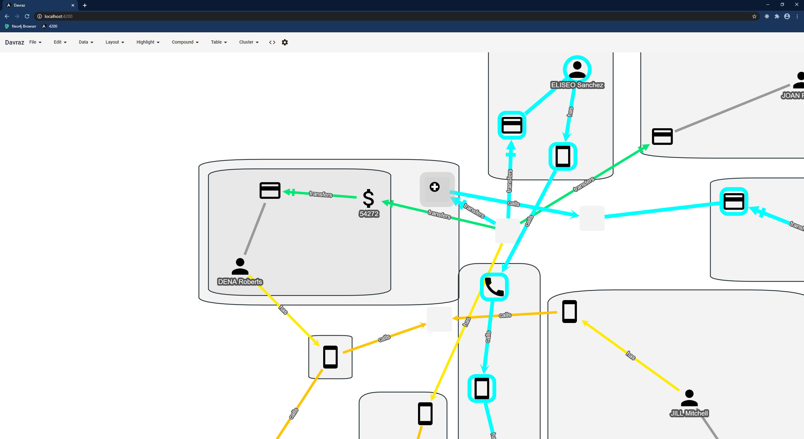
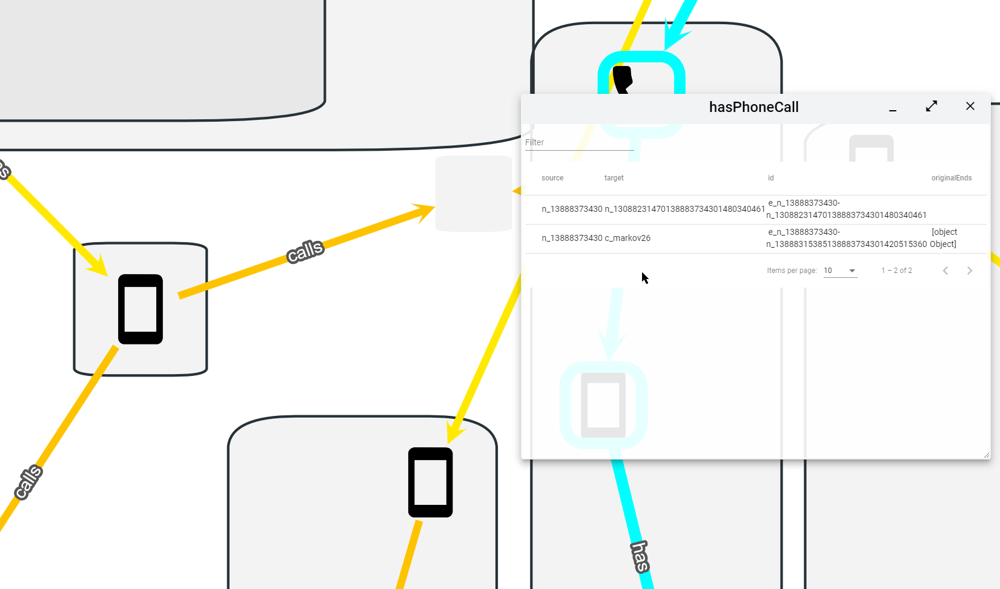
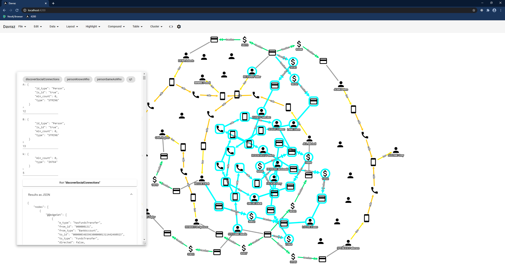

# Davraz

A graph visualization and exploration tool. Firstly designed for tiger graph database, might support other graph databases in the feature. You can watch [introductory video](https://www.youtube.com/watch?v=I8BgFve4sA8)

I was a virtual attendee at the Graph+AI World 2020! Graph+AI World Day 2 Keynote #GraphAIWorld https://www.tigergraph.com/graphaiworld/ 
You can directly watch [my presentation in the event from here](https://player.vimeo.com/video/463259298#t=49m10s)

1. To visualize a tiger graph database, fill [db-config.json](db-config.json) file. You should fill everything except for `token` and `tokenExpire` fields.
2. Run `node proxy_server.js` to run proxy server. Proxy server makes HTTP request to Tiger Graph REST API and passes responses to the client-side.
3. Run `npm i` and run `npm run ng s` to run angular in development mode.
4. Open http://localhost:4200 if everything is OK, `Data>Sample Data` should bring some data from your Tiger Graph Database. 

## Screenshots

    

  Support for compound nodes

    

  Windows very similar to file explorer of an operating system

    

  Animated edges when hovered on table

    

  Show results of a query as JSON at the same time

## YAAAY!
This project got a 1st Place Reward in [TigerGraph 2020 Graphathon](https://devpost.com/software/graphex)

## todo (or might todo)

* adding/updating graph elements 
* client-side filterig with raw cytoscape.js
* badges on the nodes
* show statistics
* graph theoretical properties
* support for Neo4j

This project was generated with [Angular CLI](https://github.com/angular/angular-cli) version 10.0.4.

## Development server

Run `ng serve` for a dev server. Navigate to `http://localhost:4200/` . The app will automatically reload if you change any of the source files.

## Code scaffolding

Run `ng generate component component-name` to generate a new component. You can also use `ng generate directive|pipe|service|class|guard|interface|enum|module` .

## Build

Run `ng build` to build the project. The build artifacts will be stored in the `dist/` directory. Use the `--prod` flag for a production build.

## Running unit tests

Run `ng test` to execute the unit tests via [Karma](https://karma-runner.github.io).

## Running end-to-end tests

Run `ng e2e` to execute the end-to-end tests via [Protractor](http://www.protractortest.org/).

## Further help

To get more help on the Angular CLI use `ng help` or go check out the [Angular CLI README](https://github.com/angular/angular-cli/blob/master/README.md).
